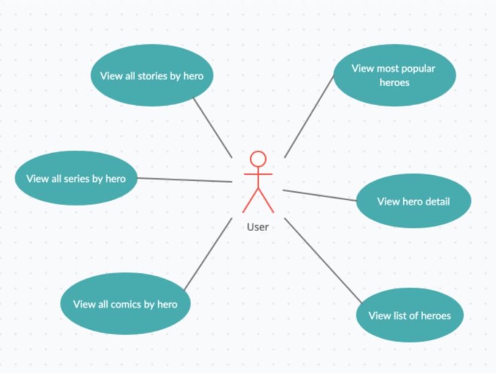

# Marvel iOS App 

Aplicación iOS de ejemplo que hace uso del api de Marvel: (https://developer.marvel.com/docs)

## Arquitectura

El proyecto se ha diseñado en una arquitectura multicapas que definen los niveles de responsabilidad sobre las funcionalidades de la aplicación. Cada una de estas capas o niveles contiene un conjunto de clases con responsabilidades relacionadas con la capa a la que pertenecen. 

Las capas implicadas son: 

- **Capa Presentación:**

Responsable de la correcta presentación de la información para el usuario teniendo en cuenta las condiciones y características del entorno, así como del dispositivo desde el que se consulta. En esta capa intervienen los objetos más próximos a la interacción con el usuario como son los componentes UI, las vistas y todos aquellos objetos que sirven de apoyo a esta tarea. 

Los objetos de esta capa también gestionan las navegaciones, los flujos, así como otras cuestiones adicionales propias de la interacción con el dispositivo como pueden ser los permisos, configuraciones, recursos, etc. 

- **Capa Lógicas de negocio:**

Responsable de modelar y definir las condiciones, reglas del negocio. También es responsable de definir y ejecutar los casos de uso del negocio. En esta capa intervienen los objetos que modelan el negocio como son: las Entidades del negocio, las clases de Casos de Uso, Paquetes y Módulos de lógicas, etc. 

- **Capa Acceso a datos:**

Responsable realizar las solicitudes de datos a las fuentes de información. En esta capa intervienen los objetos que realizan tareas para obtener, guardar, editar y eliminar información necesaria desde los casos de uso. 

De forma general, podemos representar las interacciones así: 

Esta arquitectura permite delegar responsabilidades únicas a los objetos en distintos niveles de jerarquía. La idea principal es que se pueda desarrollar una acción concreta del negocio interviniendo los objetos necesarios para su correcto desempeño.  

Para caso de uso del negocio intervienen únicamente los objetos responsables para su desarrollo y ejecución lo que hace que el proyecto sea mucho más escalable, legible, resiliente y adaptable. También proporciona un entorno más adecuado para el trabajo en equipos, teniendo en cuenta la propia implementación, pero también el diseño y las pruebas. 

A continuación, se muestra de forma más detallada la interacción entre objetos de las distintas capas. 

En el proyecto se puede ver que está organizado de acuerdo con la arquitectura multicapas propuesta.

## Patrón de arquitectura MVP 

Se debe elegir cuidadosamente un patrón de arquitectura adecuado a las características del proyecto. 

En una arquitectura multicapas por responsabilidades todas las capas son muy importantes, pero es habitual que la capa de presentación sufre más cambios con las actualizaciones del sistema operativo o los evolutivos del proyecto.  

Para las características del proyecto Marvel he decidido implementar un patrón de arquitectura Model-View-Presenter (MVP) ya que es un patrón muy limpio sin demasiada redundancia de objetos, lo que lo hace perfecto para esta implementación. 

> **Nota:** También he valorado otros patrones de arquitectura, por ejemplo, **Model-View-ViewModel (MVVM)** pero como finalmente no usaremos el lenguaje SwiftUI o componentes usando paradigma reactivo no es el patrón más recomendable para este caso. 

**Model-View-Presenter (MVP)**

En cualquier caso, se implementa desacopladas que permita a futuro cambiar el patrón de arquitectura sin afectar demasiado el funcionamiento. 

## Principios SOLID 

Son principios de buenas prácticas de programación que actúan como guía o ruta para hacer mejores implementaciones. Aunque desde un sentido práctico no es obligatorio seguirlos al pie de la letra, es importante comprender las bases y aplicar aquellas recomendaciones que mejoren el proyecto. 

En el caso de proyecto Marvel he aplicado algunas de las importantes recomendaciones en SOLID, por ejemplo: 

- **Principio de responsabilidad única:** Evito en el proyecto construir objetos extensos con más de una responsabilidad. Siempre diseñaremos objetos con una funcionalidad muy concreta y que se pueda desarrollar en una cantidad de código aceptable. Si fuese muy grande la funcionalidad sería mejor separarla en varias. 

- **Principio de Open-Close:** Las clases del proyecto basados en este principio siempre serán Cerradas a modificaciones, pero Abiertas a extensiones. Siempre se extenderán objetos para nuevas funcionalidades de forma tal que se mantenga la simplicidad del objeto original. Entre otras cosas esto nos permitirá que nos posibles refactors no impliquen afectaciones en muchas partes del proyecto. 

- **Principio de Alta cohesión y bajo acoplamiento:** Es importante que los objetos del proyecto actúen como piezas dentro de un engranaje perfecto en el software. Pero siempre vigilamos que la interacción entre estas piezas evite el acoplamiento fuerte entre ellas. Esto me permitirá en determinados momentos modificar incluso sustituir las piezas sin demasiado problemas. Para conseguir esto implemento objetos de interfaces, que actúen como contratos que conecten las distintas capas. 

- **Principio de Liskov:** Emplear clases o interfaces abstractas para definir los objetos de roles fundamentales en la aplicación. Esto ayudará también al desacoplamiento de las capas. 

**Inyectando dependencias (DI)**

Como en un proyecto los objetos tienen dependencias unos con otros, en aras de garantizar la alta cohesión y el bajo acoplamiento empleo la Inyección de dependencia como instrumento de poder tener control sobre quién y cómo depende de cada objeto. Esto me ayudará a aplicar modificaciones futuras al proyecto, así como para construcción de Test Unitarios. 

Las técnicas aplicadas para las inyecciones de dependencias son: 

- ServiceLocator 
- Dependency Injection Container 
- Dependency Injection Initialization 

## Funcionalidades de la app 

En términos generales la aplicación las funcionalidades: 

- Ver los superhéroes más populares (funcionalidad inventada) 
- Ver todos los superhéroes de Marvel 
- Ver el detalle de un superhéroe. 
- Para un superhéroe dado ver todos sus comics. 
- Para un superhéroe dado ver todas sus series. 
- Para un superhéroe dado ver todos sus stories. 

Se pueden ver representados en este diagrama de casos de uso de negocio: 

## UX/UI 

Partiendo de la base que conozco muy poco sobre el mundo de los superhéroes hay que dedicar un momento a pensar sobre el contexto de la aplicación y hacia qué público está orientada, para conseguir la mejor experiencia posible. 

Buscando en Google he encontrado algún patrón visual que me puede ayudar como base para la UI de la app. Se puede ver como para los comics se emplean frames irregulares y muy coloridos.  

Usando esta técnica como guía he desarrollado un prototipo de interfaz (herramienta Figma) aplicando esta idea. 

Uso la herramienta (https://coolors.co/) para generar una paleta de colores para trabajar: 

Ya que el desarrollo es un ejemplo, no buscaré dedicar demasiadas horas a perfeccionar los aspectos visuales, pero mantendré un mínimo de trabajo para cuidar la UX/UI como, por ejemplo: 

- Todas las interacciones con la interfaz estarán enfocadas en preservar la experiencia que ya tienen los usuarios en el entorno Apple y con dispositivo Apple. 
- Soporte para el Dark Mode. 
- Se utiliza en framework de Apple UIKit. 
- A modo general los componentes usados son: UILabel, UITableView, UICollectionView, UIView, etc. 
- Para el diseño de vistas utilizo XIB files que luego inyecto a una clase que la gestiona. 
- Creo un contenedor de recursos con: Imágenes, Colores y Fuentes personalizadas. 
- También siempre es bueno crear elementos que sorprendan al usuario. Existe algún elemento oculto. 
