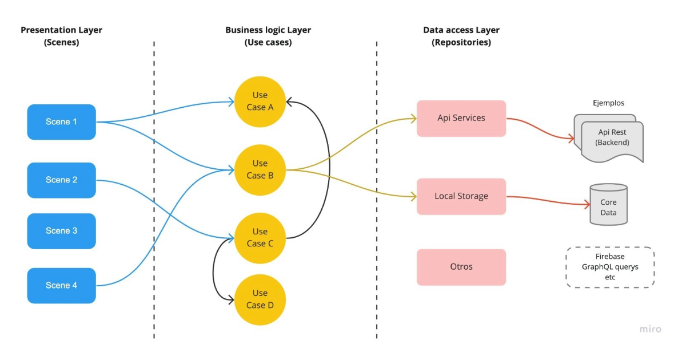

# Marvel iOS App 

Aplicación iOS de ejemplo que hace uso del api de Marvel: (https://developer.marvel.com/docs)

## Arquitectura

El proyecto se ha diseñado en una arquitectura multicapas que definen los niveles de responsabilidad sobre las funcionalidades de la aplicación. Cada una de estas capas o niveles contiene un conjunto de clases con responsabilidades relacionadas con la capa a la que pertenecen. 

Las capas implicadas son: 

- **Capa Presentación:**

Responsable de la correcta presentación de la información para el usuario teniendo en cuenta las condiciones y características del entorno, así como del dispositivo desde el que se consulta. En esta capa intervienen los objetos más próximos a la interacción con el usuario como son los componentes UI, las vistas y todos aquellos objetos que sirven de apoyo a esta tarea. 

Los objetos de esta capa también gestionan las navegaciones, los flujos, así como otras cuestiones adicionales propias de la interacción con el dispositivo como pueden ser los permisos, configuraciones, recursos, etc. 

- **Capa Lógicas de negocio:**

Responsable de modelar y definir las condiciones, reglas del negocio. También es responsable de definir y ejecutar los casos de uso del negocio. En esta capa intervienen los objetos que modelan el negocio como son: las Entidades del negocio, las clases de Casos de Uso, Paquetes y Módulos de lógicas, etc. 

- **Capa Acceso a datos:**

Responsable realizar las solicitudes de datos a las fuentes de información. En esta capa intervienen los objetos que realizan tareas para obtener, guardar, editar y eliminar información necesaria desde los casos de uso. 

De forma general, podemos representar las interacciones así: 

Esta arquitectura permite delegar responsabilidades únicas a los objetos en distintos niveles de jerarquía. La idea principal es que se pueda desarrollar una acción concreta del negocio interviniendo los objetos necesarios para su correcto desempeño.  

Para caso de uso del negocio intervienen únicamente los objetos responsables para su desarrollo y ejecución lo que hace que el proyecto sea mucho más escalable, legible, resiliente y adaptable. También proporciona un entorno más adecuado para el trabajo en equipos, teniendo en cuenta la propia implementación, pero también el diseño y las pruebas. 

A continuación, se muestra de forma más detallada la interacción entre objetos de las distintas capas. 

En el proyecto se puede ver que está organizado de acuerdo con la arquitectura multicapas propuesta.

## Patrón de arquitectura MVP 

Se debe elegir cuidadosamente un patrón de arquitectura adecuado a las características del proyecto. 

En una arquitectura multicapas por responsabilidades todas las capas son muy importantes, pero es habitual que la capa de presentación sufre más cambios con las actualizaciones del sistema operativo o los evolutivos del proyecto.  

Para las características del proyecto Marvel he decidido implementar un patrón de arquitectura Model-View-Presenter (MVP) ya que es un patrón muy limpio sin demasiada redundancia de objetos, lo que lo hace perfecto para esta implementación. 

